# Reverse Engineering⚙️.

## 1. Konsep Dasar dan Binary Executeable
Reverse Engineering adalah proses menganalisis suatu sistem, perangkat lunak, atau perangkat keras untuk memahami cara kerjanya tanpa memiliki akses ke dokumentasi atau kode sumber aslinya.  

Tujuan dari reverse engineering dapat beragam, seperti menemukan kerentanan keamanan, memahami algoritma suatu program, melakukan kompatibilitas dengan sistem lain, atau bahkan untuk keperluan forensik digital.

### Berkenalan dengan IDA
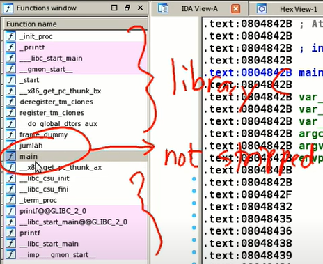
<br>
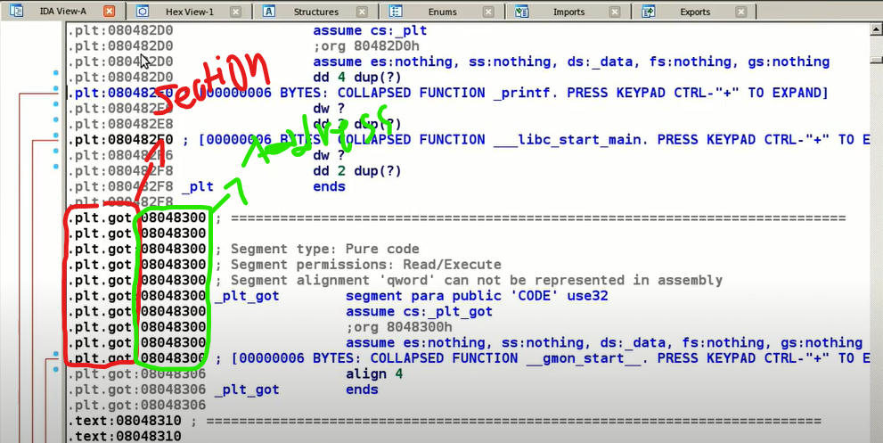
<br>

> Address dalam IDA menunjukkan lokasi memori di mana suatu instruksi atau data ditempatkan saat program dijalankan.

> Section dalam IDA merujuk pada bagian-bagian terpisah dalam sebuah file biner atau executable. Setiap section memiliki fungsi tertentu dalam eksekusi program.

#### Beberapa Section yang umum ditemukan:
.init -> Entry Point yang dieksekusi sebelum fungsi main.  
.text -> Berisi kode mesin (instruction) dari program.  
.data -> Berisi variabel yang dapat diubah selama runtime (variable global yang diinisialisasi juga masuknya kesini).  
.bss -> Berisi variabel yang belum diinisialisasi.  
.rodata -> Berisi data hanya-baca, seperti string yang tidak boleh diubah.  
.plt (Procedure Linkage Table) & .got (Global Offset Table) -> Digunakan dalam mekanisme dynamic linking pada ELF.  
.fini -> Fungsi yang dieksekusi setelah semuanya selesai (finish).

``Praktik Program 1``
```c
#include <stdio.h>

int p = 100;
int testing = 0;

int jumlah(int a, int b){
    int c = a + b;
    return c;
}

int main(int argc, char **argv){
    printf("Hello World\n");
    int x,y,z;
    x = 20;
    y = 16;
    z = jumlah(x, y);
    printf("%d\n", z);

    testing = 1337;
    printf("%d\n", testing);
    return 0;
}
```

> Note: Jika Variable Local saat di decompile akan lenyap dan akan terganti, sedangkan Variable Global akan tetap aman.

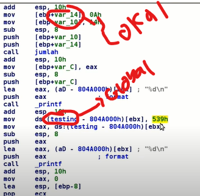
<br>

### Apa Itu Stripped?
Stripped merujuk pada file biner (executables) yang telah dihapus simbol-simbol debugging dan informasi simbolik seperti nama fungsi, variabel, dan informasi lain yang bisa membantu dalam analisis kode.

```sh 
# decompile dulu
strip namaProgram
file namaProgram
# pastikan ada kata "stripped"
```

Jika dilihat dari IDA, Nama functionnya langsung hilang:  
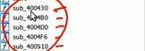
<br>

Cara Mengetahui fungsi ```main```:  
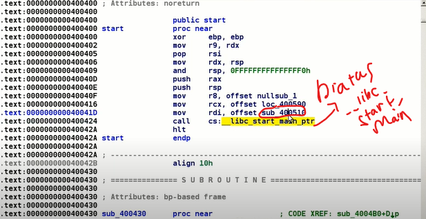
<br>

### Perbedaan Program Normal dengan Stripped
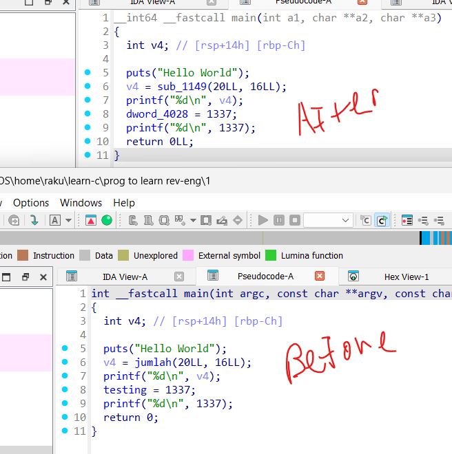
<br>

## 2. Static Analysis - 1

[*Program rev1*](compile/reverse1)  
[*Source code*](reversing1.c)    
Penyelesaian -> Check Function ``check_pin``

[*Program rev2*](compile/reverse2)  
[*Source code*](reversing2.c)  
Penyelesaian -> Decompile saja

> Note: Program rev2 ini, diganti dari yang awalnya pointer, ``char *key`` yang pasti sudah kelihatan di addressnya menjadi ``char key[]`` variable stack, yang harus di decompile dulu untuk menyelesaikannya.


## 3. Static Analysis - 2
[*Program rev3*](compile/reverse3)  
[*Source code*](reversing3.c)  

Penyelesaian -> Analysis

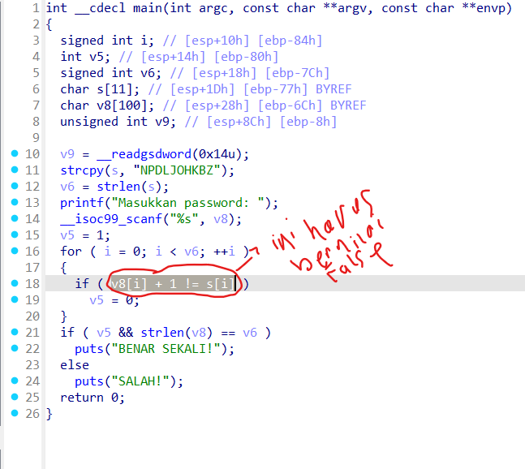
<br>

Kita harus bernilai ``False`` untuk mereturn 0  
Dari code diatas, kita harus membaliknya, seperti ini

```c
input[i] = v8[i] - 1
```

Maka value dari variable stack, tiap hurufnya harus **digeser -1**  

```c
// indikasi bahwa setiap karakter dalam password dikurangi 1
if (pass[i] + 1 != key[i]) v = 0;
// pass[i] + 1 berarti menambahkan 1 ke setiap huruf yang kamu masukkan.
```

> Password yang benar = ``"NPDLJOHKBZ"`` dikurangi 1 per huruf -> ``"MOCKINGJAY"``

___

[*Program rev4*](compile/reverse4)  
[*Source code*](reversing4.c)  

Penyelesaian -> Decompile, analisis, telusuri variable key.

Check function ``decode_key()``:  
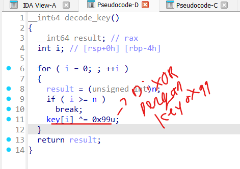
<br>

Dari key tersebut, kita lakukan ``XOR`` dengan nilai hexadecimal ``0x99``:  
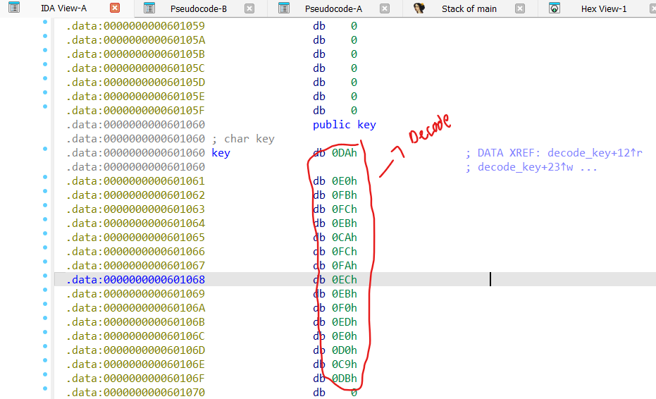
<br>

```python
key = [0xda, 0xe0, 0xfb, 0xfc, 0xeb, 0xca, 0xfc, 0xfa, 0xec, 0xeb, 0xf0, 0xed, 0xe0, 0xd0, 0xc9, 0xdb]
key2 = [i ^ 0x99 for i in key]
print(key2)

''.join(chr(num) for num in [67, 121, 98, 101, 114, 83, 101, 99, 117, 114, 105, 116, 121, 73, 80, 66])
#CyberSecurityIPB
```

## 4. Debugging dengan GDB
### Apa itu Dynamic Analysis?
Dynamic Analysis adalah metode dalam reverse engineering di mana sebuah program dieksekusi dan dianalisis saat berjalan (runtime).  

Berbeda dengan static analysis yang hanya memeriksa kode tanpa mengeksekusinya, dynamic analysis memungkinkan kita untuk mengamati perilaku program secara langsung  

Caranya, yaitu dengan memasang ``breakpoint()``, dengan ``breakpoint``, kita dapat memeriksa program yang berjalan untuk mengetahui  ``register, memory, dll``

> Beberapa perintah untuk Debugging GDB: https://www.geeksforgeeks.org/gdb-command-in-linux-with-examples/


## 5. ltrace
``ltrace`` adalah alat debugging di Linux yang digunakan untuk **melacak pemanggilan library** (shared library calls) yang dilakukan oleh suatu program selama eksekusi.  

Dengan ltrace, kita bisa melihat bagaimana suatu binary berinteraksi dengan pustaka C standard library (libc).

```bash
ltrace ./reverse4

printf("masukkan password: ")             = 19
__isoc99_scanf(0x563565af6018, 0x7ffcb0297810, 0, 0masukkan password: coba) = 1
strcmp("coba", "CyberSecurityIPB") #langsung dibandingkan dengan string yang asli        = 32
puts("salah!\n"salah!)                          = 8
+++ exited (status 0) +++
```

## 6. Static linked binary
### Perbedaan Static Linked Binary dan Dynamic Linked Binary

#### Dynamic Linked Binary
Binary yang di-link secara dinamis tidak menyertakan pustaka dalam file executable, tetapi mengandalkan pustaka yang ada di sistem.
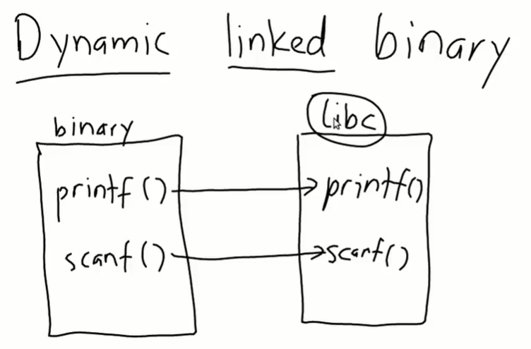
<br>

#### Static Linked Binary
Binary yang di-link secara statis menyertakan semua pustaka yang dibutuhkan dalam satu file executable.
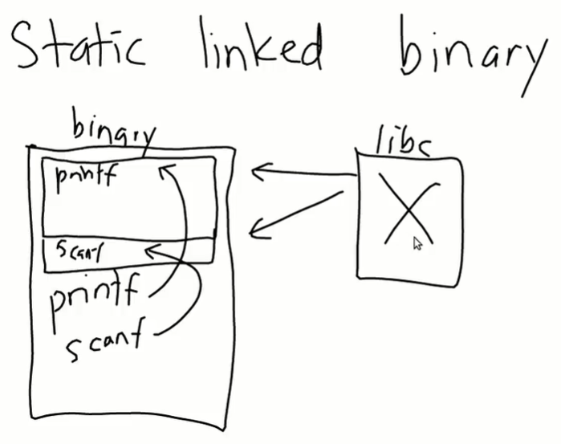
<br>

```bash
gcc reversing4.c -o reversing4 -static #compile supaya menjadi static
ldd compile/rev4_static 
        not a dynamic executable #check
```

#### Lakukan Decompile pada masing masing program untuk melihat perbedaannya!

### Sekian dan Terimakasih👋